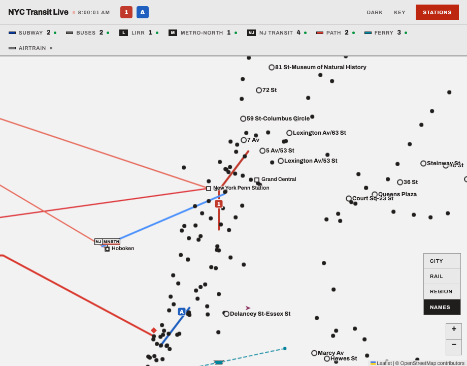
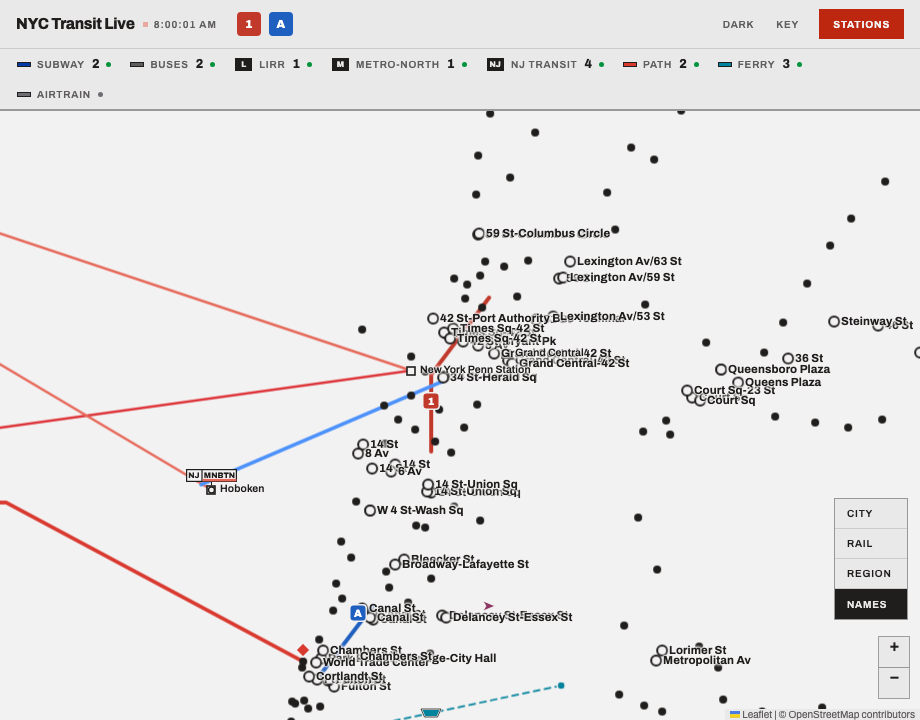
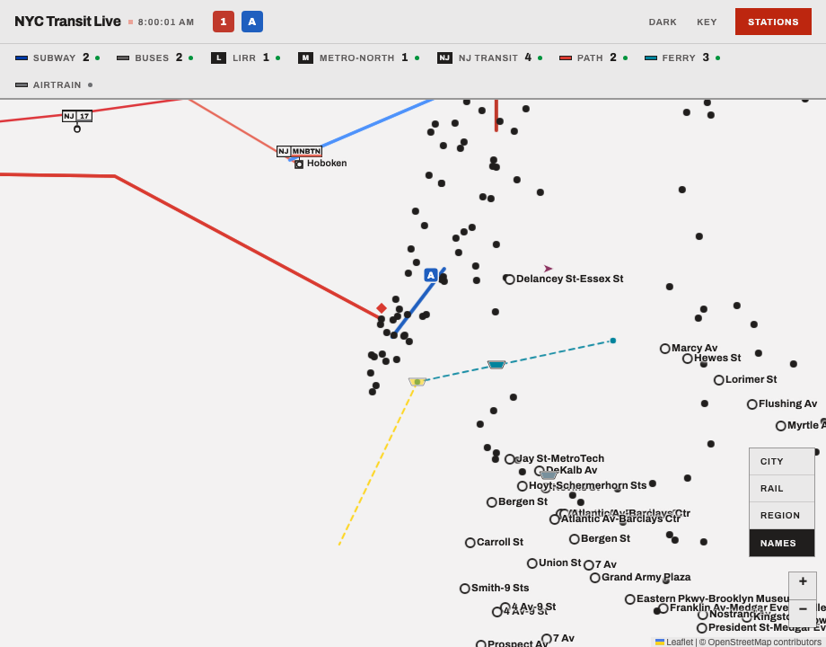
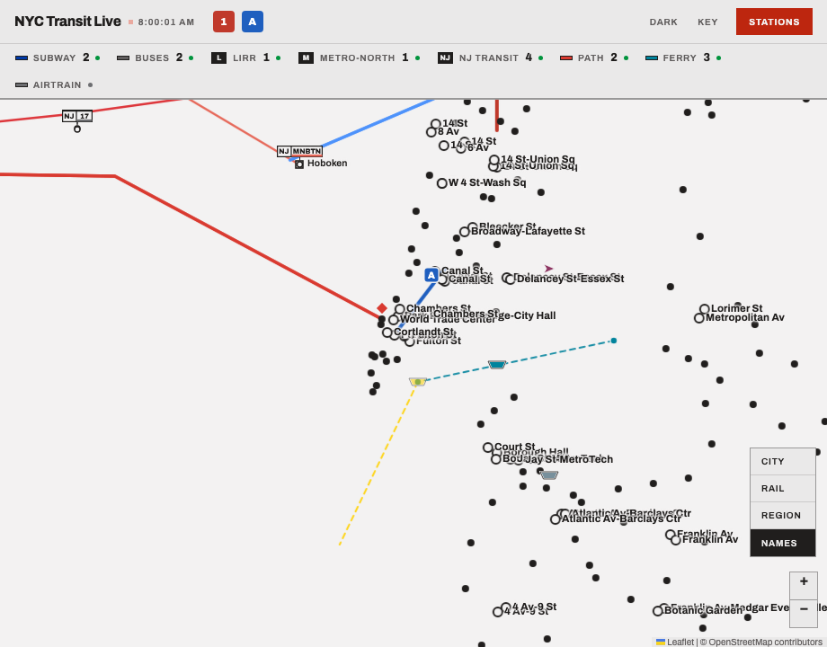

# Subway hubs: a hub is a station complex, not a stop

Backend and frontend, four commits, the ruling that followed the label-band diagnosis of
2026-09-25: the backend half (`92636bc`), the frontend half (`ff030f0`), the adversarial
review's fixes (`3ff5c49`) and this record. Nothing
touches `njt_auth.py` or any credentialed path, so **no NJ Transit mint was spent**.

## The finding

On the deployed build at zoom 13 with Names pressed, the map named 96 St, 86 St, 72 St,
Carroll St, 25 St and 36 St, in a band that shows hubs only. The diagnosis measured three
candidate causes against production and the hermetic fixtures and ruled all three out: the
band's thresholds were MR2's (12 and 14), the Names toggle only ever hides, and the hasHubs
fallback was not engaged (all 496 stations list routes). **Every one of those names was a hub
under F9's rule.** The band, the toggle and the data were all correct; the definition was
inverted.

F9 counted trunks **per stop_id**. Measured on production's own `/api/subway-stops`, grouped
by `transfers.txt`:

| | |
| --- | --- |
| rings under F9 | **124** |
| of those, on a stop `transfers.txt` joins to no other | **108**: the B beside the C on Central Park West, the F beside the G at Carroll St, the D beside the R on Fourth Avenue, the 5 beside the 2 up White Plains Road. Shared track, not interchanges. |
| real complexes (two or more stops) | 35 |
| of those, with no ring at all | **22**, Times Square among them, because each of its five stops carries exactly one trunk. So do Grand Central, Union Square, Herald Square, Fulton St, Canal St and Broadway Junction. |

The diagnosis first said 102 and 26, grouping stops within 250 m; these are the same counts
over the MTA's own table.

## The ruling

**A hub is a station complex.** `transfers.txt` becomes a required member of the subway
static archive, by the visible-loss rule PR 116 applied to `stop_times.txt`, because three
rider-visible consumers read it: the transfer ring, the hub label class, and the MR5 kicker.
The backend derives `complex_id` per stop from its cross-stop rows (union-find over the
pairs; a stop in no row is its own complex) and serves it on `/api/subway-stops`, additive,
`None` by default. The frontend's predicate reads the trunks served across every stop in the
complex: **a hub is a complex serving three or more trunks, or two or more trunks across two
or more stops.** The ring and the label class read the same predicate; the kicker lists the
routes of the complex, not the stop. The station alerts join is untouched.

## The change

**1. `transfers.txt` joins `_REQUIRED_MEMBERS`**, so a publication without it fails the load
through `require_members`, the group reports `failed`, `HEALTH_SUBWAY_STATIC_FAILED` fires and
the last-known-good stays: the F1 chain, unchanged, with one more member in it. The comment
above the tuple names the three consumers and, while it was open, the **fourth consumer of the
routes index** that F1's list of three had missed: the MR5 kicker, which draws the routes
calling at a station and is empty without them.

**2. `load_subway_station_complexes`** reads the cross-stop rows (a row from a stop to itself
is a minimum transfer time, not a complex, and is dropped), folds any platform id to its
parent, and closes the pairs by union-find. The complex id is the **smallest station id in
the complex**, so it is stable across loads and is always a real station (Times Square is
`127`). A stop in no row is alone, by its own id. An id that is no station can still link two
that are, and is never a key. It **raises** rather than swallowing, like the routes loader
beside it, and the warmup assigns both only after the whole attempt succeeds.

**3. `complex_id` on `SubwayStop`**, `str | None = None`, additive for the reason
`RailroadRoute.color` gave: the payload is cached for an hour, and a client holding
yesterday's must not fail on a field the server has only just begun to send. `None` means no
index is loaded, which the endpoint keeps apart from a complex of one. The field-set lock is
updated, not relaxed.

**4. `isTransferStation(complex)`** takes `{routes, stops}`, the complex's routes unioned and
its stop count. `subwayComplexIndex` builds one shared object per complex from the payload,
`loadStations` keeps it on each registry entry, and the ring, the hub label class, the theme
repaint, `paintZoomBand`'s hub count and D2j's oracle all ask that object. A stop only counts
toward "two or more stops" if something calls there, so a closed sibling platform cannot ring
the shared-track stop beside it.

**A bare routes list names no complex, and gets F9's per-stop answer.** That is what PATH's
`[]` is (no routes, so a dot either way), what every caller written before complexes hands in,
and what a payload without `complex_id` is. The last is real: `/api/subway-stops` is served
`max-age=3600` while the scripts revalidate, so for an hour after the deploy a returning rider
runs the new code on yesterday's payload. The first version read that payload as "every stop
alone", and the review measured the result (finding H1): 14 rings, and no subway name in Manhattan
at zoom 12 or 13 with Names pressed. Read as F9's answer, it draws yesterday's map until the
next fetch (**D2i5**). The backend keeps the same distinction on the wire: `complex_id` `None`
is "no index loaded", never "a complex of one".

**5. The kicker** lists the complex's routes through `stationKickerRoutes`, **with the stop's
own first**: R3's cap shows three marks before its `+N`, and a rider who clicked the 7's dot
should see the 7 among them. A stop alone lists exactly its own routes, so every other board
is unchanged to the byte.

**6. The alerts join stays on the stop's own routes.** An alert for the 1 belongs on the 1's
platform. The registry keeps `routes` beside the new `complex` for exactly that reader, and
for the station panel.

**7. The two stale comments** the diagnosis found, near `LABEL_NO_HUB_ZOOM` and above
`namesToggleAnnouncement`, said `stop_times.txt` was not a required member and
`load_subway_station_routes` returned `{}`. Both now say it raises, and that the backend half
has landed.

## One reading the ruling's words allow, measured

"Two or more trunks across two or more stops" could mean the union of the complex's trunks,
or that the trunks must come from different stops. On the live table the two readings differ
at exactly three complexes: 149 St-Hostos (222 on the 2/5, 415 on the 4), 62 St / New Utrecht
Av (the D/R/W and the N/W) and Delancey St-Essex St (the F and the J/M/Z). All three are real
interchanges under either reading, so the union is implemented and nothing turns on it today.

## The census

On production's payload, **124 rings under F9 become 100 stops in 48 complexes**, all 48
pinned by name in `subway.spec.js` **D2i1**:

| complex | stops | routes |
| --- | --- | --- |
| **168 St-Washington Hts / 168 St** (`112`) | 2 | 1 A C |
| **59 St-Columbus Circle** (`125`) | 2 | 1 2 A B C D |
| **Times Sq-42 St / 42 St-Port Authority Bus Terminal** (`127`) | 5 | 1 2 3 7 7X GS A C E N Q R W |
| **14 St / 6 Av** (`132`) | 3 | 1 2 3 F FX M L |
| **149 St-Hostos** (`222`) | 2 | 2 5 4 |
| **Park Place / Chambers St / World Trade Center / Cortlandt St** (`228`) | 4 | 2 3 A C E N R W |
| **Fulton St** (`229`) | 4 | 2 3 4 5 A C J Z |
| **Borough Hall / Court St** (`232`) | 3 | 2 3 4 5 N R W |
| **Atlantic Av-Barclays Ctr** (`235`) | 3 | 2 3 4 5 B Q D N R W |
| **Franklin Av-Medgar Evers College / Botanic Garden** (`239`) | 2 | 2 3 4 5 FS |
| **Junius St / Livonia Av** (`254`) | 2 | 2 3 4 5 L |
| **161 St-Yankee Stadium** (`414`) | 2 | 4 B D |
| **59 St / Lexington Av/63 St / Lexington Av/59 St** (`629`) | 3 | 4 5 6 6X F M N Q R W |
| **51 St / Lexington Av/53 St** (`630`) | 2 | 4 6 6X E F FX |
| **Grand Central-42 St** (`631`) | 3 | 4 5 6 6X 7 7X GS |
| **14 St-Union Sq** (`635`) | 3 | 4 5 6 6X L N Q R W |
| **Bleecker St / Broadway-Lafayette St** (`637`) | 2 | 4 6 6X B D F FX M |
| **Canal St** (`639`) | 4 | 4 6 6X J Z N Q R W |
| **Brooklyn Bridge-City Hall / Chambers St** (`640`) | 2 | 4 5 6 6X J Z |
| **74 St-Broadway / Jackson Hts-Roosevelt Av** (`710`) | 2 | 7 7X E F FX M R |
| **Queensboro Plaza** (`718`) | 2 | 7 7X N W |
| **Court Sq / Court Sq-23 St** (`719`) | 3 | 7 7X E F FX G |
| **5 Av / 42 St-Bryant Pk** (`724`) | 2 | 7 7X B D F FX M |
| **145 St** (`A12`) | 2 | A C B D |
| **14 St / 8 Av** (`A31`) | 2 | A C E L |
| **W 4 St-Wash Sq** (`A32`) | 2 | A C E B D F FX M |
| **Jay St-MetroTech** (`A41`) | 2 | A C F FX N R W |
| **Franklin Av** (`A45`) | 2 | A C FS |
| **Broadway Junction** (`A51`) | 3 | A C J Z L |
| **62 St / New Utrecht Av** (`B16`) | 2 | D R W N |
| **34 St-Herald Sq** (`D17`) | 2 | B D F FX M N Q R W |
| **Prospect Park** (`D26`) | 1 | B FS Q |
| **Delancey St-Essex St** (`F15`) | 2 | F FX J M Z |
| **4 Av-9 St** (`F23`) | 2 | F G D N R W |
| **Forest Hills-71 Av** (`G08`) | 1 | E F FX M R |
| **67 Av** (`G09`) | 1 | E F M R |
| **63 Dr-Rego Park** (`G10`) | 1 | E F M R |
| **Woodhaven Blvd** (`G11`) | 1 | E F M R |
| **Grand Av-Newtown** (`G12`) | 1 | E F M R |
| **Elmhurst Av** (`G13`) | 1 | E F M R |
| **65 St** (`G15`) | 1 | E F M R |
| **Northern Blvd** (`G16`) | 1 | E F M R |
| **46 St** (`G18`) | 1 | E F M R |
| **Steinway St** (`G19`) | 1 | E F M R |
| **36 St** (`G20`) | 1 | E F M R |
| **Queens Plaza** (`G21`) | 1 | E F FX R |
| **Metropolitan Av / Lorimer St** (`G29`) | 2 | G L |
| **Myrtle-Wyckoff Avs** (`L17`) | 2 | L M |

Ten of the 48 are single Queens Boulevard stops (36 St, 46 St, Steinway St, Northern Blvd, 65 St,
Elmhurst Av, Grand Av-Newtown, Woodhaven Blvd, 63 Dr-Rego Park, 67 Av): the E, the F/M and the
R at one stop, three trunks, because the E and the F run local there at night. That is the
ruling's three-trunk clause as written, and it names 36 St G20 as a hub on purpose. Forest
Hills-71 Av, Queens Plaza and Prospect Park are the other three single-stop hubs.

## Before and after, the diagnosis's own grid

The diagnosis's scripts, rerun unchanged except that the oracle reads the complex. Each cell
is band, labels drawn / labels drawn with the hub class, and the City preset's in-view count.
"Before" is the deployed build (`d49e9a7`) against production; "after" is this branch against
the same payload plus `complex_id`, through the hermetic mocks.

| zoom | Names | before: deployed, production | after: this branch, same payload |
| --- | --- | --- | --- |
| 11 | on | none, 0 / 0, 0 in view | none, 0 / 0, 0 in view |
| 12 | on | hubs, **124 / 124**, 88 in view | hubs, **100 / 100**, 92 in view |
| 13 | on | hubs, **124 / 124**, 25 in view | hubs, **100 / 100**, 67 in view |
| 14 | on | all, 496 / 124, 76 in view | all, 496 / 100, 76 in view |
| 15 | on | all, 496 / 124, 36 in view | all, 496 / 100, 36 in view |
| 11 to 15 | off | the same bands, 0 / 0 | the same bands, 0 / 0 |

`stationLabelShown`, D2j's oracle, disagreed with the page 0 times in every cell of both
columns, and no local name is drawn in either hubs band. The other hermetic worlds are
unchanged: the stock fixture (two one-trunk stations, no hub) still shows every name from 13,
D2j's world still has its one hub at Fulton St (three trunks at one stop), and the
`routes: []` world still reads F1's degraded band.

**One transition world, measured because it is real for an hour.** A browser holding the
pre-deploy payload runs the new frontend on stops with no `complex_id`. At `3ff5c49` that draws
exactly the "before" column: hubs, 124 / 124 at 12 and 13, 88 and 25 in view at the City
preset, the oracle agreeing in every cell. At `ff030f0` it drew 14 / 14, which is review
finding H1 and the reason for the change above.

## What a rider sees, and one finding for the operator

Zoom 13, Names on, production's payload through the hermetic mocks, 1280 wide. Left is
`d49e9a7`, right is this branch at `ff030f0`; on this payload `3ff5c49` draws the same hundred
rings and names (the grid above was rerun there).

| before | after |
| --- | --- |
|  |  |
|  |  |

Before: 72 St and 81 St on Central Park West named, 7 Av and 5 Av/53 St named, and Times
Square, Grand Central, Union Square, Herald Square, Canal St and Fulton St drawn as plain dots
with no name. After: the reverse, which is the ruling.

**FINDING FOR THE OPERATOR: a complex's name is now drawn once per stop, and they overprint.**
The ruling puts the ring and the hub class on every stop of a hub complex, and a name label is
per stop, so **32 of the 100 hub labels repeat a name another stop of the same complex already
draws**: "Times Sq-42 St" four times, "Fulton St" four, "Canal St" four, "Grand Central-42
St", "14 St-Union Sq", "Atlantic Av-Barclays Ctr" and "Broadway Junction" three each, and
fifteen more twice. Under F9 it was 3. At zooms 12 and 13 they sit a few metres apart and
overprint, visibly in both screenshots (Grand Central, Union Square, Canal St, and Chambers St
against Brooklyn Bridge-City Hall), and the City preset's zoom 13 now carries 67 hub names in
view where it carried 25.

**Not changed here, because it is a design decision and the ruling made the other one**: "the
ring and the label class read the same predicate". The narrowest remedy would keep the ring on
every stop and give the `hub` class (and so the name at 12 and 13) to one stop per complex,
the one whose id is the complex id, which is one predicate plus one comparison. Names at 14
and above would still be per stop, as they are today for every local. That is the operator's
to rule on; nothing in this branch depends on the answer.

## Tests

Hermetic throughout except the one contract-tier scenario, which runs the real app against
the simulator. Nothing needs the network or a credential.

**The committed archive is new.** The subway had none: its static tests built synthetic zips.
`backend/tests/fixtures/subway_gtfs/` now carries `stops.txt` and `transfers.txt` **copied byte
for byte from the live publication** (Last-Modified 2026-08-27), which is the one production
had promoted on the day of the diagnosis, with a README recording what the table looks like:
every id a parent station, every cross row reversed, all 35 complexes fully meshed. The e2e
census reads `tests/e2e/fixtures/subway_stops_real.json`, production's payload of that day
plus `complex_id` from the branch's real loaders, and a backend test holds it to the
committed archive so the two fixtures cannot drift apart silently.

| Claim | Test |
| --- | --- |
| **the complex table on the real publication**: Times Square's five stops (`127`, `725`, `902`, `A27`, `R16`) are one complex, `127`; Court Square's three are one; a stop in no row is alone by its own id; the diagnosis's shared-track stops are alone | `test_static_data.py::test_the_committed_archive_complex_table` |
| **the stop count is unchanged**: all 496 parent stations are keyed and nothing else is, 444 complexes, 35 of more than one stop, the largest five | the same test |
| **a zip lacking `transfers.txt` fails the load**, at the validator and end to end (cache rejected, redownload rejected, load raises) | the `[transfers.txt]` cases of F1's `test_validate_rejects_an_archive_without_the_station_routes_tables` and `test_a_reduced_publication_fails_the_load_rather_than_serving_an_empty_index` |
| the loader raises rather than serving every stop alone | `test_load_subway_station_complexes_raises_without_transfers` |
| **the union-find**: A-B and B-C with A-C unlisted is one complex | `test_a_three_stop_chain_is_one_complex` |
| a self row joins nothing; a non-station id links the closure and is never a key; platform ids fold to parents | `test_a_stop_in_no_row_is_its_own_complex_and_self_rows_join_nothing`, `test_a_non_station_id_links_the_closure_but_is_never_a_key` |
| the census fixture agrees with the committed archive: ids, order, names, complex ids | `test_the_e2e_census_fixture_agrees_with_this_archive` |
| the endpoint serves `complex_id`; `None` with no index loaded; five stops under one id | `test_api.py::test_subway_stops_lists_stations`, `..._complex_id_is_none_when_no_index_is_loaded`, `..._serves_every_stop_of_a_complex_under_one_id` |
| the warmup wires the index, a raise fails the group, and a failed reload keeps both indexes | `test_subway_static_warmup_loading_to_ready`, `test_subway_static_failed_complex_load_fails_and_keeps_the_previous_index` |
| the declared required set moved deliberately | `test_static_shared.py::test_required_member_set_is_exactly_what_is_declared[subway]`, and `test_validator_rejects_an_archive_missing_a_required_member[subway-transfers.txt]` |
| the field-set lock, updated not relaxed | `test_models.py::test_subway_stop_field_set_is_locked` |
| through the real warmup at the contract tier: Times Square's three stops in the sim join into `127` | `test_contract_api.py::test_the_station_complexes_ride_the_real_warmup_to_the_stops_endpoint` |
| **node: the predicate over the diagnosis's table**: 96 St, 86 St and 72 St on Central Park West, Carroll St, 25 St and 36 St R36 local; 36 St G20 a hub; Times Square and Court Square hubs, every stop | `subway.test.js` "hub definition: the diagnosis's stations, asked of their complexes" |
| node: the rule itself, both clauses, the stop-count edge cases, and the census (124 before, 100 in 48 after) | "hub definition: a complex is a ring at three trunks...", "...the census over the real payload, before and after" |
| node: `subwayComplexIndex` and `stationKickerRoutes` | "...groups by complex_id and leaves a missing one out", "...the kicker lists the complex's routes, the stop's own first" |
| **e2e: the ring census before and after**, measured in one page on the drawn rings: 124 by F9's rule, 100 by the complex rule, the 48 complexes by name, rings and hub labels the same stations, all five of Times Square ringed | `subway.spec.js` **D2i1** |
| **e2e: the band at zoom 13 over the Upper West Side draws no local**, anywhere; 96 St, 86 St and 72 St in view and not drawn | **D2i2** |
| **e2e: the kicker at Times Square lists every trunk**: from the 7's platform, all 13 routes of the complex, five trunks, the 7 and 7X first, three plates and `+10` | **D2i3** |
| e2e: the alerts join still seeds from the stop's own routes: on the 7's platform the 7's alert and not the 1's, although the kicker names the 1; on the 1's platform the reverse | **D2i4** |
| e2e: **a theme swap repaints the same hundred rings** (review finding H3) | **D2i1**, after the census |
| e2e: **a payload with no `complex_id` draws F9's map**, 124 rings, and the band still has hubs at the City preset (H1) | **D2i5** |
| node: a closed sibling platform does not make a complex two stops (H4) | "hub definition: a stop nothing calls at does not make a complex two stops" |
| backend: transfer types 3, 4 and 5 join nothing, a blank type joins (H7) | `test_a_transfer_type_that_says_no_change_joins_nothing` |
| backend: the complex id is the smallest STATION id, whatever the row order and whatever non-station id links the complex (H10) | `test_the_complex_id_is_the_smallest_station_in_it_whatever_the_order` |
| **F11's alerts pin holds** | `pins.spec.js` **P3c**, its golden untouched |

**Three node tests rewritten rather than deleted**, because the rule they asserted changed:
"one trunk is a local dot and two or more is a transfer ring" became the complex rule's test,
F9's pairs test keeps its one-trunk half and moves its two-trunk examples across two stops,
and the label test gains the complex forms. **P2a's golden moves by one field**, `complex`,
and against `main` the whole change to `mr_pins.json` is one line, `"complex": null`: the stock
world names no complex, and its registry entry says so. Nothing else in the golden moved.
D2i's title and D2's fixture comment now say three trunks at one stop, which is what makes
Fulton St its world's one hub.

## Mutations, each run and recorded

Each in a real `git worktree` detached at the commit under test, applied alone, the named tiers
run against it, and the tree verified clean before and after. The four the ruling named ran at
`ff030f0` and **again at `3ff5c49`**, with the review's guards added; the table is the second
run.

| # | Guard reverted | Result | Killed by |
| --- | --- | --- | --- |
| M1 | the predicate counting per stop again (F9's `trunks >= 2`, the stop count ignored) | **killed** | node: **the diagnosis's stations** (96 St first) and six more; e2e **D2i1**, **D2i2** |
| M1b | the same at the draw's call site: the ring and the label handed the stop's own routes | **killed** | e2e **D2i1**, **D2i2**. Node cannot see a call site, which is why the e2e tier exists |
| M2 | `transfers.txt` removed from the required tuple | **killed** | the two `[transfers.txt]` F1 cases, the declared-set gate and `test_validator_rejects_an_archive_missing_a_required_member[subway-transfers.txt]` |
| M3 | the kicker reading the stop's routes | **killed** | e2e **D2i3**, and **D2i4**'s premise |
| M4 | union-find dropped for pairwise only (each station's own partners) | **killed** | **`test_a_three_stop_chain_is_one_complex`**, the non-station link test, and the H7 and H10 tests |
| M5 | H1's fallback removed: a bare routes list read as a stop alone | **killed** | e2e **D2i5**; node, three tests |
| M6 | the theme repaint asking the stop's routes | **killed** | e2e **D2i1**'s theme swap. At `ff030f0` this survived the whole suite, which is review finding H3 |
| M7 | every stop counted toward "two stops", routed or not | **killed** | node, the H4 test |
| M8 | the transfer-type filter removed | **killed** | `test_a_transfer_type_that_says_no_change_joins_nothing` |
| M9 | the complex id as the first station stops.txt lists | **killed** | `test_the_complex_id_is_the_smallest_station_in_it_whatever_the_order` |
| M9b | the complex id as the union-find root | **killed** | the same test, through the lower-sorting non-station id |

**What M1 did not kill at `ff030f0`, measured, and said so rather than hidden: D2j.** D2j's
oracle and the page share `isTransferStation`, so a mutation to the rule moves both sides,
which is the limit D2j's own comment already records. The node tier and D2i1 are what pin
the rule.

**What M4 does not kill: the committed-archive table.** The live table is fully meshed, so a
pairwise match gives the right answer on it. That is recorded in the fixture's README, and it
is why the synthetic chain exists.

## The adversarial review

One round, over `92636bc..ff030f0`, run as the repository's `adversarial-review` workflow in
its own worktree: five finders (silent failure, removed behaviour, boundary and type, test
vacuity, operator reality), a triage that merged 17 candidates into 10, and batched verifiers.
**Nine confirmed, one refuted.** Six are fixed in `3ff5c49`; three are the operator's. The
findings are numbered H1 to H10 here, because this record already cites MR2's F1 and F9 and
the review's own F-numbers collided with them.

| # | Severity | Finding | Disposition |
| --- | --- | --- | --- |
| H1 | medium | A payload with no `complex_id` (a browser's cached copy for the hour after a deploy) read as "every stop alone": 14 rings, no subway name in Manhattan at 12 or 13, Names pressed | **Fixed.** A bare list gets F9's answer; **D2i5** |
| H2 | medium | A `transfers.txt` that is present with no cross-stop rows loads as every stop alone under `ready`, and the comment claimed the requirement prevented that | **Comment fixed; the gap is for the operator**, below |
| H3 | medium | No test repainted the rings on a theme swap where complex and stop disagree; the repaint mutated to per-stop survived | **Fixed.** D2i1 swaps to dark; M6 now dies |
| H4 | low | A stop with no service counted toward "two or more stops" | **Fixed**, node test, M7 |
| H5 | low | The Key still reads "Subway transfer station: two or more route lines meet", and 95 stops where two lines meet at one stop now draw a dot | **For the operator**, below |
| H6 | low | The two corrected comments overclaimed: an absent `stop_times.txt` fails the load, a header-only one does not | **Fixed** |
| H7 | low | `transfer_type` 3 (no transfer possible) and 4/5 (in-seat) joined stops | **Fixed**, test, M8 |
| H8 | low | The contract monitor's `SUBWAY_REQUIRED_MEMBERS` is still `("stops.txt", "shapes.txt")`, so its drift check passes a publication production now refuses | **For the operator**, below |
| H9 | low | "Nothing covers paintZoomBand's hub count reading the complex" | **Refuted**: its premise that no e2e world carries `complex_id` is false (D2i1's does) |
| H10 | low | Nothing held "the smallest station id" | **Fixed**, test, M9 and M9b |

### For the operator: three decisions, none blocking

1. **The repeated names (above), with the screenshots.** One remedy is one comparison: the
   `hub` class on the stop whose id is the complex id.
2. **H2 and H8, one question: how deep "required" goes.** The ruling reused PR 116's rule,
   and that rule checks presence. A `transfers.txt` with headers only, or with only self rows,
   passes it and loads as every stop alone under `ready`, with no signal but one INFO log line
   ("496 stations, 496 complexes"). The same was already true of a header-only
   `stop_times.txt`. A floor would be one `require_parsed` call per member, the gate
   `stops.txt` already has; the hermetic archives that carry these files header-only (the
   subway test builders and F08's four) would need one real row each. Separately, the
   six-hourly monitor's subway tuple predates PR 116. Widening it to match
   `_REQUIRED_MEMBERS` is one line plus its synthetic archives; F1's branch chose not to,
   relying on `/healthz`, which sees a cold start but not a warm process refusing a new
   publication.
3. **H5, the Key's words.** "Two or more route lines meet" was F9's exact rule and is now true
   of every ring, but not of every station where two lines meet. P1e allows an addition, so a
   second clause is possible without moving the pin. Left alone because the words are the
   Key's and the ruling did not reach them.

## Gates

At `3ff5c49`, the code tip, from the worktree, with the credentials scrubbed. This record's
commit adds documents and screenshots only.

| Gate | |
| --- | --- |
| `pytest` (backend) | **1752** passed, from 1738 on `main` at `d49e9a7` |
| `ruff check`, `ruff format --check` | clean, 79 files |
| `mypy` | clean, 30 source files |
| node tier, `node --test "frontend/*.test.js" "tests/*.test.js"` | **402** passed |
| hermetic e2e, the full suite | **323** passed (two workers; see below) |
| contract-tier lint and format | clean |
| contract API tier | **39** passed (38 before, plus the complex scenario) |
| contract browser tier | **5** passed |
| `run_all.sh` | **15 of 15** |

**Three things about how they were run, because another session was working in the same
repository at the same time.**

- **Every run was in `/Users/benjaminrosenfield/nyc-transit-live-hubs`**, a worktree of its
  own. The first minutes of this branch were not: a `git switch` in the main checkout moved
  another session's HEAD, and its commit `8e30014` landed on this branch. It was moved back to
  `claude/bus-zoom-rule` with `git reset --keep`, this branch was reset to `d49e9a7`, and that
  session confirmed its tree intact. Nothing of either branch is in the other.
- **The hermetic e2e ran on port 5184**, through a config that re-exports
  `tests/e2e/playwright.config.js` unchanged but for the port, because the repository's config
  reuses whatever already holds 5173 and the other session held it. The contract browser tier
  cannot move (its spec reads the ports from its config), so it ran on 5174 and 5175 in a
  window agreed with that session.
- **The node tier's `nodetier.test.js` needs `TMPDIR` resolved on macOS.** Its loader hook
  compares `/private/var/...` with `/var/...`, and it fails that way on untouched `main` too.
  CI runs on Linux, where the two are one path.

**The e2e suite needed two workers to mean anything on this machine today**, and the runs that
did not are recorded rather than dropped. The other session was running Playwright mutation
passes back to back, and the load average sat between 20 and 33 on 8 cores. At the default
four workers the full suite at `3ff5c49` failed 6 specs on one run and 17 on the next. All but
two failed inside `boot`, before the page loads, on Playwright's "clock.pauseAt: Cannot
fast-forward to the past", which is a race in the suite's frozen-clock boot. The other two
were timing assertions (A1v3's announcement and A7h's superseded fetch). Rerun alone, the
failures passed, A1y 4 of 4 on this branch and on `main`, and the whole suite then passed 323
of 323 at two workers. Before the review commit was amended to renumber its findings (it was `47153da` then, and its
code differed from `3ff5c49` only in eleven comment and test-title lines), the default-worker
run had passed 323 of 323 at a lower load.

**The merge with `claude/bus-zoom-rule` will meet in two files**, both additive on each side:
`frontend/helpers.js` (that branch adds bus-band helpers; this one changes the station
predicate) and `tests/e2e/fixtures/mr_pins.json` (that branch adds P6's pins; this one adds one
line to P2a's).

---
🤖 Generated with [Claude Code](https://claude.com/claude-code)

https://claude.ai/code/session_01Ap2nYH4fmBJS44TNwaTyoE
